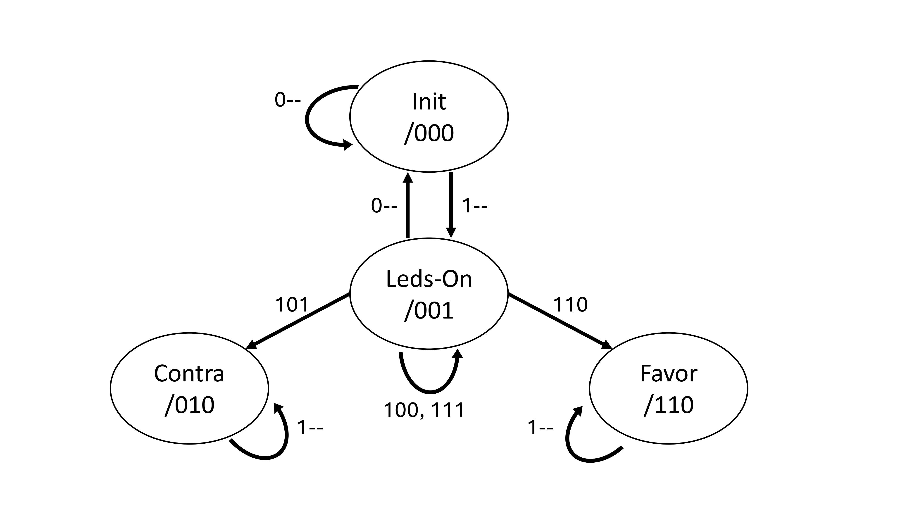

# Practice 1: Electronic Voting System
## Overview
This project implements and verifies an electronic voting system for 8 voters, developed as part of the Digital Electronics course at the University of Málaga.
> The general module is composed of 3 main modules: Cuenta_Votos_Completo, Visualiza_Cuenta, Resultado_de_Votación.

> The voting is considered finished when all voters have cast their vote. This is indicated through an additional input (button 0 of the Nexys3).

## Repository Contents

| File / Folder | Type | Description |
| --- | --- | --- |
| ``P1_A2-08.pdf`` | Document | Practice 1A: combinational design, schematics, Karnaugh maps, simulations. |
| ``P1_A2-08_VHDL.pdf`` | Document | VHDL implementations of ``Cuenta4_votos`` (logic, IF, CASE) + shared testbench. |
| ``P1B_A2-08.pdf`` | Document | Practice 1B: sequential design, vote register (``Reg_Vot``), state machine analysis. |
| ``P1A`` | Folder | First Part of the Practice, completely combinational |
| ``P2B`` | Folder | Second Part, which includes sequential module |
| ``Diagrams`` | Folder | State Diagram and Test Bench Cronograms |

---

# Technical Summary
## Part A — Combinational Design
### Architecture
The system is divided into three main blocks:
- Cuenta_Votos_Completo — counts votes from 8 voters (two symmetric 4‑voter blocks).
- Visualiza_Cuenta — displays partial results on seven‑segment displays.
- Resultado_de_Votación — determines Approved, Rejected, or No Qualified Majority.

### Vote Counting
Each 4‑voter block uses the Cuenta_4_votos module, derived analytically from truth tables and Karnaugh maps. Outputs S2:S0 encode the number of “yes” votes.

### Qualified Majority (7/8)
- A motion is approved only if 7 or 8 voters vote in favor.
- Rejected if 5–8 votes against.
- Otherwise: No qualified majority.

### Button 0 Behavior
Button 0 on the Nexys3 enables result visualization only while pressed, reflecting a purely combinational design.

## Part B — Sequential Design (Vote Register Module)
Practice 1B introduces the sequential subsystem responsible for registering votes, managing voter selection, and controlling LED indicators.

### Main Sequential Modules
- Reg_Vot — core vote‑registering module (Moore machine).
- Regs_Vot — array of 8 Reg_Vot modules (one per voter).
- ENA_GEN — combinational selector ensuring only one voter is active at a time.
- Puls_On_Off — edge detector and debouncer for button inputs.
- Ctrl_Leds — LED multiplexer controlling system visualization.

### Reg_Vot — Moore State Machine
The module stores:
- Whether the voter has voted (V_R).
- Whether the vote was in favor (VF_C = 1) or against (VF_C = 0).
- Whether the voter is currently being called to vote (Led_V = 1).

It uses:
- Two D flip‑flops (q1, q0) → 4 possible states:
  - 00 → Init
  - 01 → Leds_On (voter called)
  - 10 → Vote Against
  - 11 → Vote In Favor

The full state transition diagram is available in:

 ``Diagrams/``  

  
### ENA_GEN — Voter Selector
Generates ENA(n) such that:
- ENA(n) = 1 only if exactly one Sel(n) is active.
- If none or multiple selectors are active → all ENA = 0.

### Puls_On_Off — Debounce & Edge Detection
Implements:
- Falling‑edge detection
- Basic bounce mitigation
- Single‑cycle pulse generation

### Ctrl_Leds — LED Output Multiplexer
- Controls LED behavior:
  - D0 → Active voter
  - D1 → Final vote result
  - D2 → Voters who have already voted
  - D3 → All voters have voted
 
---

## How to Run Simulations
### Environment
- Xilinx ISE
- ISim or compatible VHDL simulator

### Part A Simulations
Exhaustive testbenches for combinational modules.
Cuenta_Votos_COMPLETO simulation iterates through all 256 combinations.

### Part B Simulations
- Reg_Vot chronogram simulating the full voting sequence.
- Reg_Vot_Exc and Reg_Vot_CASE VHDL versions tested independently.
- Comparison of chronograms included in ``P1B_A2-08.pdf``.

### FPGA Deployment
- Load top.bit onto Nexys3.
- Validate LEDs and seven‑segment displays.

## VHDL Modules
### Combinational
- Cuenta4_votosVHDL — logic, IF, CASE versions.
- Arithmetic modules: Sumador_Completo, Restador, Complemento_a2.

### Sequential
- Reg_Vot_Exc — explicit logic version.
- Reg_Vot_CASE — state machine version.
- ENA_GEN, Puls_On_Off, Ctrl_Leds.

## Known Issues & Notes
### ISE Static File References
ISE may keep stale references to removed testbenches.
Solution: remove both files, delete the old testbench, re‑add the correct one.

### Button Debounce
Puls_On_Off mitigates bounce using flip‑flops and edge detection, but slow presses may still cause multiple transitions.

### Sequential Logic Considerations
In Reg_Vot_CASE, flip‑flops must update on every rising edge; gating updates with ENA leads to mismatches with hardware behavior.

---

Credits
- Authors: Raúl Escudero Jiménez, José Luis Pérez Martín
- Course: Digital Electronics
- Instructor: Javier López García
- University of Málaga — Escuela de Ingenierías Industriales
