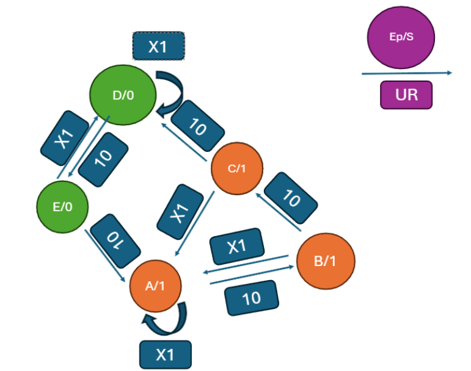

# Practice 2: State Machine Design
## Overview
This project implements and analyzes a finite state machine (FSM) used to control the opening and closing sequence of a secure door system.
The design follows a complete engineering workflow:
- State definition
- State transition diagram
- Transition table
- Boolean function derivation
- Sequential circuit synthesis
- VHDL implementation
- Simulation and validation using test vectors and timing chronograms

This practice was developed as part of the Digital Electronics course at the University of Málaga.

## Repository Contents
| File / Folder | Type | Description |
| --- | --- | --- |
| ``P2_A2-08.pdf`` | Document | Full report: state machine design, boolean functions, schematics, VHDL, simulations. |
| ``Cronograms/`` | Folder | State transition diagram and simulation chronograms. |
| ``P2/`` | Folder | Project Folder with modules and tests |

---
# Technical Summary
## 1. Control Module Design
The system models a secure door controlled by a sequence of button presses.
Two signals determine transitions:
- U — User pressed the correct button in the sequence
- R — Error or timeout (OR of F and FC)



The FSM contains five states, encoded as EST(2:0):
### State A — Initial State (000)
- Door closed
- Reached on reset, timeout, or incorrect button press
- Also reached after completing the closing sequence

### State B — First correct button (001)
- Transition from A when U = 1

### State C — Second correct button (011)
- Transition from B when U = 1

### State D — Door open (111)
Reached by:
- Completing the opening sequence (third correct U)
- Failing during closing (R = 1 in D or E)

### State E — First correct closing button (110)
- Transition from D when U = 1

The full state diagram is available in:
``Cronograms/``

---
2. State Transition Table
The FSM transitions depend on the pair UR, where:
- U = 1 → correct button
- R = 1 → error or timeout
- UR = X1 → always treated as error (safety rule)

Example (simplified):
| Present State | U=0,R=0 | U=0,R=1 | U=1,R=0 | U=1,R=1 |
| --- | --- | --- | --- | --- |
| A | A | A | B | A |
| B | B | A | C | A |
| C | C | A | D | A |
| D | D | D | E | D |
| E | E | D | A | D |

A full expanded table including Q2,Q1,Q0 and output S is provided in the PDF.

## 3. Boolean Functions
Using Karnaugh maps, the next-state logic (D2, D1, D0) is derived from the transition table.

Example:

```
D0 = R·q2·q1 + U·¬R·¬q2·¬q1 + ¬R·q0·¬q2 + ¬U·q2·q1·q0
D1 = U·¬R·¬q2·q0 + ¬R·q1·q0 + ¬U·q2·q1 + R·q2·q1
D2 = ¬R·U·q1·q0 + ¬U·q2·q1 + R·q2·q1
```
### Output Function
The door is closed when S = 1, which corresponds to states A, B, C:

```
S = ¬D2·¬D1·¬D0 + ¬D2·¬D1·D0 + ¬D2·D1·D0
```
## 4. Schematics
The full circuit includes:
- Three D flip-flops with asynchronous clear
- Combinational next-state logic
- Output logic
- Auxiliary modules:
  - VCodAc (button sequence encoder)
  - Temporizador (timeout counter)
  - Door_SMD (door control)

Schematics are available in the PDF

---

# Simulation
## 1. Test Vectors
Two test sequences were implemented using VHDL testbenches:
- ### Test 1 — Correct Opening, Closing with Abort
  - Opening sequence: correct (U pulses)
  - Closing sequence: error introduced (R = 1)
  - System returns to initial state and requires restarting the closing sequence

- ### Test 2 — Opening with Abort, Correct Closing
  - Opening sequence: error introduced
  - System resets
  - Closing sequence executed correctly

## 2. Chronograms
Chronograms validate:
- Correct state progression
- Proper handling of errors
- Door opening and closing behavior
- Reset and clear logic

Both chronograms are available in:
``Diagrams/``

## 3. VHDL Implementation
The Control_VHDL module implements the FSM using:
- A D flip-flop process with asynchronous clear
- A CASE-based next-state process
- Falling-edge clock triggering
- Output logic based on current state
- The VHDL version matches the schematic behavior in both simulation and FPGA deployment.

---
# Conclusions
This practice provided a complete workflow for designing a sequential digital system:
- State definition and diagram
- Transition table and boolean minimization
- Sequential circuit synthesis
- VHDL implementation
- Simulation and FPGA validation

The final system behaves correctly under all tested conditions, including error handling, timeouts, and reset logic.

---

## Credits
Author: Raúl Jiménez Escudero, José Luis Pérez Martín

Course: Digital Electornics

Instructors: Javier López García

University of Málaga — Escuela de Ingenierías Industriales
