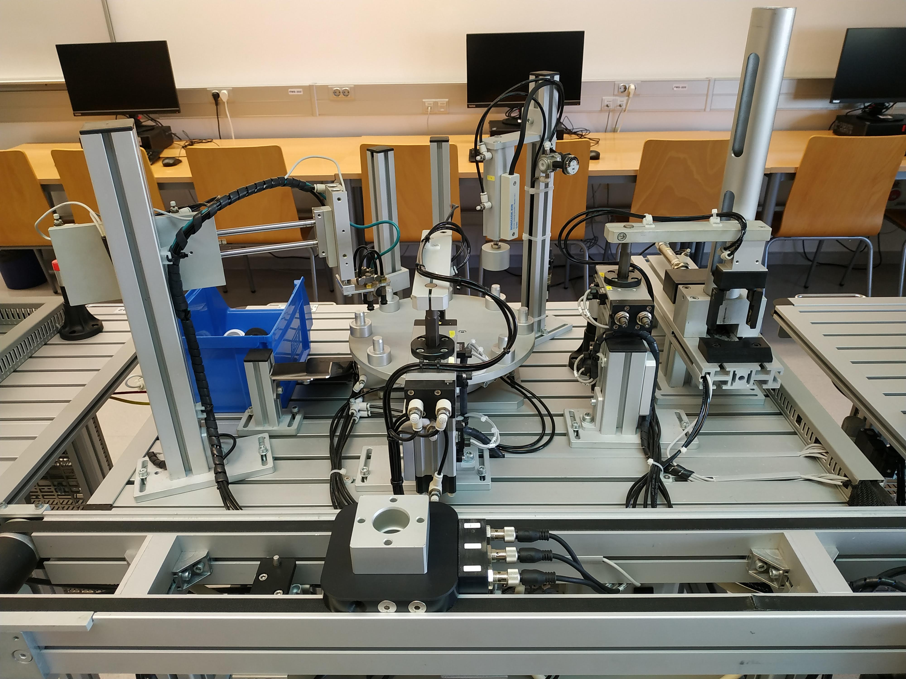

# GEMMA‑Based Control Design for FMS‑205 (TwinCAT 3)
This repository contains the full implementation of the FMS‑205 automated station using TwinCAT 3, Beckhoff PLCs, structured PLC programming, SFC/GRAFCET, and the GEMMA methodology for operational modes and safety logic.

The project includes a modular PLC architecture, task coordination, pneumatic actuation control, sensor integration, and a complete HMI developed with TwinCAT Visualizations.

## 🖼️ Machine Overview



---

## 📌 Project Overview
The goal of this project is to design and implement the control logic for a flexible manufacturing station (FMS‑205) using industrial automation standards.
The system handles:

- Loading and unloading operations
- Pneumatic manipulation
- Measurement and inspection
- Material classification
- Error handling and recovery
- Operational mode management (manual, automatic, step‑by‑step, pause, reset)

The implementation follows a clean, modular, and scalable architecture suitable for real industrial environments.

## 📂 Repository Structure
```
GEMMA_FMS205/
│
├── TwinCAT Project1/          # PLC source code (POUs, DUTs, GVLs, VISUs)
├── docs/                      # Technical documentation (summaries, diagrams)
├── .gitignore                 # Excludes TwinCAT build artifacts and binaries
└── README.md                  # This file
```
Only source files are included.
All TwinCAT‑generated binaries, libraries, caches, and runtime artifacts are excluded for clarity and professionalism.

---

# 🧩 System Architecture
## 1. MAIN (PRG)
The main program cyclically calls the station controller (FB_Estacion) every 10 ms.

## 2. FB_Estacion
### Implements:
- Initial and run conditions
- Mode management (manual, automatic, step‑by‑step)
- Task control and counters
- Signaling (lamps, buzzer)
- Synchronization with the coordinator
- Mapping of all station I/O

## 3. Coordinator (FB_Coordinador_SFC)
A high‑level SFC that orchestrates the full production sequence:
- Position pallet
- Load base
- Press bearing
- Unload base
- Transfer pallet
## Synchronization uses the standard pattern:
- Ready (output)
- Execute (input)
- Done (output)
- Ack (input)

## 4. Task Modules (FBs)
Each physical module is implemented as an independent SFC:
- FB_SituarPale_SFC
- FB_CargarBase_SFC
- FB_PrensarRodamiento_SFC
- FB_DescargarBase_SFC
- FB_TransferirPale_SFC
This structure mirrors real industrial PLC architectures.

---

# 🔧 Sensors and Actuators
## Actuators
- Double‑acting pneumatic cylinders
- Rotary‑linear cylinders
- Parallel pneumatic grippers
- Vacuum ejectors and suction cups
- Conveyor belt
- Signaling lamps and buzzer

## Sensors
- Reed magnetic sensors
- Inductive sensor
- Capacitive sensor
- Photoelectric sensor
- Linear encoder (height measurement)
- Presence and position switches

*All sensors and actuators are mapped through EtherCAT terminals (EL1008, EL2008, etc.)*.

---

# 🖥️ Human–Machine Interface (HMI)
Developed using TwinCAT Visualizations:
- Start/Stop/Emergency controls
- Mode selection
- Task counters
- Real‑time status indicators
- Sensor and actuator monitoring
- Color‑coded state feedback

# 📘 GEMMA Methodology
The control logic follows the GEMMA framework:
- Operating states:
  - Initial,
  - Running,
  - Stopped,
  - Fault
- Startup and shutdown procedures
- Fault detection and recovery
- Mode transitions
- Safety‑driven behavior

This ensures deterministic, safe, and industry‑standard operation.

---
---

# 🏆 Technical Highlights
- Modular PLC architecture (MAIN → Station → Coordinator → Tasks)
- Full SFC/GRAFCET implementation
- GEMMA‑based operational logic
- Realistic pneumatic and sensor integration
- Encoder‑based measurement logic
- Robust synchronization using Ready/Execute/Done/Ack
- Clean TwinCAT project structure (source‑only, no binaries)
- Professional documentation and I/O mapping

# 📄 Documentation
A detailed technical report is available in the docs/ folder, including:
- System description
- I/O tables
- Module breakdown
- Sequence diagrams
- GEMMA analysis
- SFC/GRAFCET charts
- HMI design

## Full technical report (PDF):  
  [FMS205_report.pdf](docs/FMS205_report.pdf)
  
---

## Credits
- Author: José Luis Pérez Martín
- Course: Industrial Automation
- Instructors: Francisco Ángel Moreno Dueñas, Víctor Eugenio Torres López
- University of Málaga — Escuela de Ingenierías Industriales


